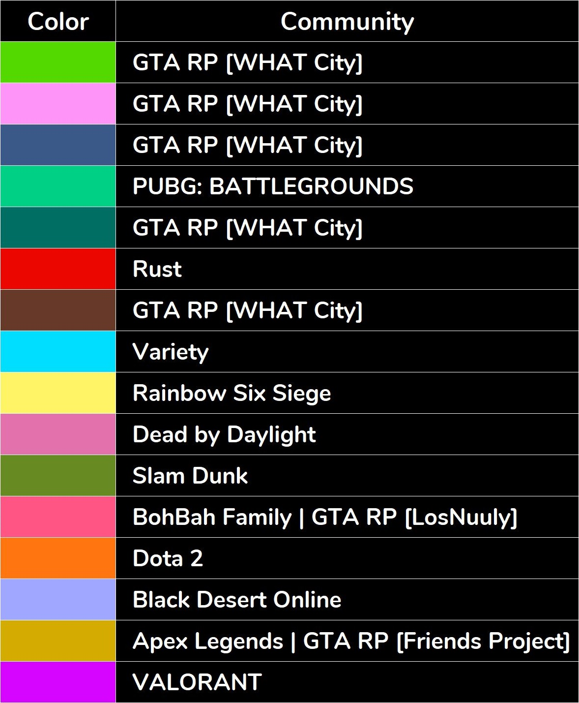

# Twitch_Communities (Thai)

This is the graph showing relations between the Thai Twitch channels and their communities. Channels are displayed as nodes (circle), with the text in the middle indicate the streamer of that channel. Relationships between them are displayed with edges (lines). The communities are displayed as the color of the node. The graph was made in Gephi software by using the data collected by running a python script.

The idea originally comes from the [Visualizing Twitch Communities](https://github.com/KiranGershenfeld/VisualizingTwitchCommunities) project by [Kiran Gershenfeld](https://github.com/KiranGershenfeld). I've done this project to practice my coding skills and find the relationship between Thai Twitch channels in particular.

For more details about the graph, see [Discussion](#discussion).

## Data

There are two parts of data to collect, channels and chatters. These data are collected by creating a python script and set to run automatically every hour for a week. Collected data used to generate node and edge data which will pass into Gephi to make the graph. These data can be described in detail as follows:

- Channels - This data is collected by making a Twitch API request to gets information about active streams. The number of streams collected each time depends on how many viewers watching the stream. By using the `viewer_count` as a condition, only streams that have the number of viewers more than the threshold are collected. For each stream information on the response, the value on the `user_name` field is collected as a channel's name, and the value on the `user_login` field is used to collect chatters data.
  - _To access Twitch API, you will need to have a Twitch account logged in to the developer console and create your application to get your client ID and secret. Then, get an access token using your client ID and secret. After that, you can use your credentials to make an API request to get the data you want. Check out the [Twitch API documentation](https://dev.twitch.tv/docs/api) and [Twitch API Reference](https://dev.twitch.tv/docs/api/reference) for more details._

- Chatters - Chatters from each channel are collected by making an API request at `https://tmi.twitch.tv/group/user/{channel_login}/chatters/` by passing the `user_login` value from the previous step. The response is returned in JSON format that contains the current chatter objects for the specified channel. Chatters data are used to determine the relationship between every two channels.

- Nodes and edges - These data are generated by using all the data collected from the previous steps. Each row in node data contains the channel's name and the total number of chatters. Each row in edge data contains the name of two channels and the weight describing how strong the connection is. The weight is calculated by finding the number of same viewers who have watched both channels. These data are used to create the graph in Gephi.

## Making the graph

- Get your credentials and fill in at [credentials.json](./data/credentials.json) and configure your settings in [main.py](./code/main.py). You can find the details of the function arguments in the docstring of each function in [collecting.py](./code/collecting.py).
- Collect channels and chatters data by running [main.py](./code/main.py). Choose the period and how often you will collect the data. You can set the task to run it automatically in the windows task scheduler.
- After collecting all the data, set the overlap_threshold in the [generate_gephi_data.py](./code/generate_gephi_data.py) to be the optimal value. Then run the script to generate node and edge data to use in Gephi. The weight between two channels that below the overlap_threshold will be considered as no relation and will exclude from the edge data.
- Create the graph in Gephi by import node and edge data, choose your layout, run the modularity on the statistics section to detect communities, set the color and size of the node to define the communities and size (numbers of viewers) of a channel.

## Discussion

This is the output from generating the graph in Gephi. The placement of node is done by Force Atlas layout algorithm and extract the community by calculating Modularity. 
From the result, the nodes with the same color can be assumed that these channels have been watched by the same group of viewers. Another thing to notice is most of the nodes that have many connections are placed close to the center while the nodes that have few connections are placed further from the center.

I've made a table and name the community for each color by finding related characteristics between the channel in the community. From my observation, most of the nodes from the same color are streamed the same games. So I name the communities name based on the game they played.

_Note that the result depends on the data collected on 2 through 9 July 2021. Therefore, the things that are happening nowadays may not match the results._
